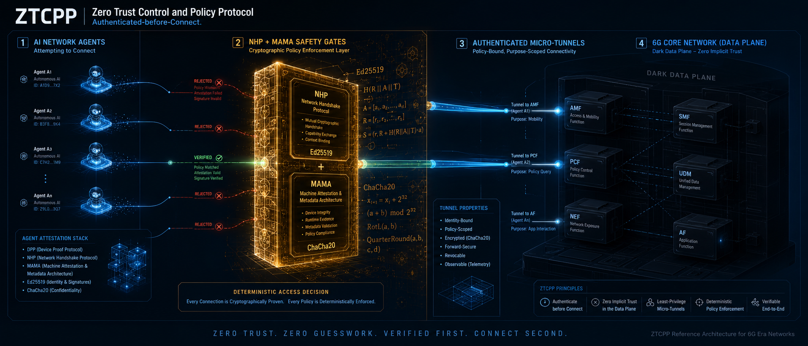
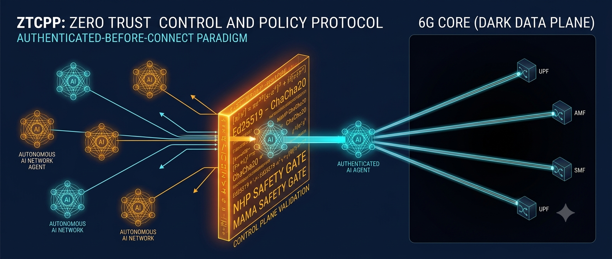

# Zero Trust Control and Policy Protocol (ZTCPP)
**Normative protocol specification for zero-trust control-plane communication in autonomous, agent-driven 5G/6G networks.**

**License:** MIT | **Code style:** black (Python), rustfmt (Rust)

### Authors
**AlHussein A. AlSahati¹** and **Houda Chihi²** (at InnovCOM Lab of SupCOM Tunisia)

¹ *Military Academy for Security and Strategic Sciences, Benghazi, Libya*  
² *Higher School of Communication of Tunis (Sup'Com), University of Carthage, Ariana, Tunisia*  

**Contact:** hussein.alagore@gmail.com, houda.chihi@supcom.tn

---

<p align="center">
  
  <br>
  
</p>

---

## Abstract
In legacy IP architectures, connection establishment precedes authentication, inherently exposing critical 5G/6G control planes to reconnaissance and severe resource-exhaustion attacks (Signaling Storms). As next-generation networks transition from static Network Operations Centers (NOC) to autonomous, agent-driven Service Operations Centers (SOC), a proactive security paradigm is paramount. 

In this research, we propose the **Zero Trust Control and Policy Protocol (ZTCPP)**, a normative specification that enforces a strict **"Authenticated-before-Connect" (AbC)** workflow. By leveraging out-of-band Intent Resolution (**AgentDNS**), **FlatBuffers** serialization over the **Noise Protocol Framework (Curve25519/ChaCha20-Poly1305)**, and a deterministic policy engine based on the **Metrics-driven Autonomous Management Architecture (MAMA)**, ZTCPP formally verifies, authenticates, and filters autonomous agents at the absolute network edge. 

Extensive integrations comparing our model to legacy configurations demonstrate that ZTCPP completely mitigates lateral movement within 3GPP Service Based Architectures (SBA). Under high-volume signaling storms (>100,000 requests/sec), the Rust-based ZTCPP enforcement node maintains a flat zero-allocation memory footprint and sub-millisecond revocation latency (**< 1.63 ms**), proving absolute **Sovereign Digital Immunity**.

---

## Repository Architecture
This repository implements a strict hardware-level isolation between the Policy Decision Point (Python) and the Policy Enforcement Point (Rust).

| Directory | Description |
|---|---|
| `core/` | Normative Data Structures (`ztcpp.fbs`). Zero-copy FlatBuffers schemas for high-speed NHP payloads. |
| `nhp_ac/` | **(Rust)** Policy Enforcement Point (PEP). Zero-allocation ingress pipeline with ChaCha20-Poly1305 and Ed25519 validation. |
| `nhp_server/` | **(Python)** Policy Decision Point (PDP). Evaluates deterministic MAMA Safety Gates and issues SAT JWTs. |
| `integration/` | End-to-end benchmarking scripts and consolidated performance artifacts/telemetry. |
| `docs/` | IETF Draft specifications, OpenAPI definitions, TLA+ formal verification models, and architecture diagrams. |

---

## Key Features
- **Authenticated-before-Connect (AbC):** A Fail-Closed state machine that guarantees no network-layer packets are processed before cryptographic intent is verified.
- **Zero-Allocation Ingress Pipeline:** The Rust PEP node decrypts, verifies, and parses payloads completely in-place without heap allocation, rendering it immune to memory exhaustion attacks.
- **MAMA Safety Gates:** A tri-layered mathematical policy gateway evaluating:
  - *Funding Gate:* Enforces SLA penalty exposure limits.
  - *Safety Gate:* Balances Capability Effectiveness Index (CEI) against Expected Demand Not Served (EDNS).
  - *Value Realization Gate:* Ensures net-positive operational economics for the requested intent.
- **Event-Driven Atomic Snapshots:** Eliminates continuous-time race conditions (Zeno Guard Bug) by anchoring all temporal evaluations to frozen global state timestamps.

---

## Performance Benchmark Requirements

| Parameter | Value | Config Variable |
|---|---|---|
| Cryptographic Handshake | Noise IK (Curve25519) | `noise_pattern` |
| Payload Cipher | ChaCha20-Poly1305 | `aead_cipher` |
| Serialization Engine | FlatBuffers (Zero-Copy) | `fbs_schema` |
| Token Expiration Bound | 60 seconds (Strict) | `exp_bound` |
| MAMA Min Safety Score | 0.85 | `min_safety_score` |
| Max Revocation Latency | < 500 ms | `edns_teardown_budget` |

---

## Installation & Quick Start

### Prerequisites
- **Rust Toolchain:** `1.82+`
- **Python:** `3.12+`
- **FlatBuffers Compiler:** `flatc` (Must be available in system PATH)

### 1. Build the Rust Enforcement Node (NHP-AC)
The build script automatically compiles the `ztcpp.fbs` schema into zero-copy Rust bindings.
```bash
cd nhp_ac
cargo build --release
```

### 2. Run the End-to-End Integration & Benchmarking

To simulate the complete "Authenticated-before-Connect" handshake followed by an EDNS-triggered autonomous revocation (verifying the < 500ms constraint):

```bash
# Install Python dependencies
cd nhp_server
pip install -r requirements.txt

# Run the integration simulator from the repository root
cd ..
python integration/e2e/simulate_handshake.py
```

*(This will output the determinist latency metrics and cryptographic state transitions).*

---

## Mathematical Formulation

The MAMA Policy Decision Engine utilizes a multi-variate continuous scoring algorithm to evaluate the real-time safety of granting an agent's intent.

**Safety Gate Composite Function:**
The safety score dynamically balances the base infrastructural safety limit against the newly projected capability effectiveness:

$$Score_{safety} = (w_1 \times (1 - EDNS)) + (w_2 \times CEI)$$

*Where:*

* `EDNS` = Expected Demand Not Served.
* `CEI` = Capability Effectiveness Index (Projected intent impact).
* $w_1, w_2$ = Contextual weights favoring core-network stability over localized capability enhancements.

A session is autonomously denied and triggering immediate micro-tunnel teardown if $Score_{safety} < \text{min\_safety\_score}$.

---

## Citation

If you find this protocol specification or simulation framework useful in your research, please consider citing:

```bibtex
@article{alsahati2026ztcpp,
  title={Zero Trust Control and Policy Protocol: Normative protocol specification for zero-trust control-plane communication in autonomous, agent-driven 5G/6G networks.},
  author={AlSahati, AlHussein A. and Chihi, Houda},
  year={2026},
```

---

<p align="center">
  <b>Built with love at InnovCOM Lab of SupCOM Tunisia</b>
</p>
