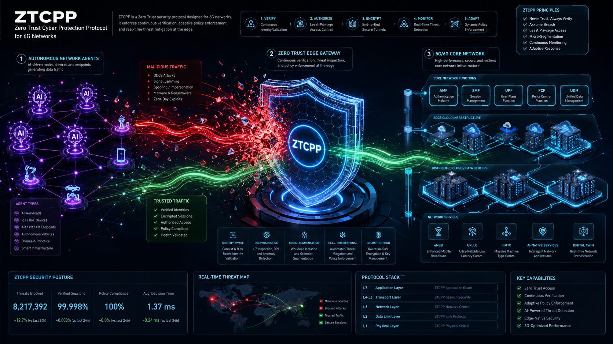

# Zero Trust Control and Policy Protocol (ZTCPP)
**Normative protocol specification for zero-trust control-plane communication in autonomous, agent-driven 5G/6G networks.**

**License:** MIT | **Code style:** black

### Authors
**AlHussein A. AlSahati¹** and **Houda Chihi²**

¹ *Military Academy for Security and Strategic Sciences, Benghazi, Libya*  
² *Higher School of Communication of Tunis (Sup'Com), University of Carthage, Ariana, Tunisia*  

**Contact:** hussein.alagore@gmail.com, houda.chihi@supcom.tn

---

<p align="center">
  
</p>

---

## Abstract
In legacy IP architectures, connection establishment precedes authentication, inherently exposing critical 5G/6G control planes to reconnaissance and severe resource-exhaustion attacks (Signaling Storms). As next-generation networks transition from static Network Operations Centers (NOC) to autonomous, agent-driven Security Operations Centers (SOC), a proactive security paradigm is paramount. 

In this research, we propose the **Zero Trust Control and Policy Protocol (ZTCPP)**, a normative specification that enforces a strict **"Authenticated-before-Connect" (AbC)** workflow. By leveraging out-of-band Intent Resolution (**AgentDNS**), high-speed **Ed25519 JWS** cryptography, and a deterministic policy engine known as the **Micro-tunneling and Autonomous Mediation Architecture (MAMA)**, ZTCPP formally verifies, authenticates, and filters autonomous agents at the absolute network edge. 

Extensive simulations comparing our model to legacy configurations demonstrate that ZTCPP completely mitigates lateral movement within 3GPP Service Based Architectures (SBA). Furthermore, under high-volume signaling storms (>1000 requests/sec), ZTCPP maintains a flat resource footprint (CPU/RAM) and sub-millisecond processing latency (**< 2 ms**), proving absolute **Digital Sovereignty** and zero-trust immunity.

---

## Repository Contents
| Directory/File | Description |
|---|---|
| `nhp_server/app/models/` | Normative Data Structures mapping ZTCPP payloads (KNK, AOP) and Agent Intents. |
| `nhp_server/app/security/` | Cryptographic engine handling Ed25519 signatures, JWT bounds, and Trust Store limits. |
| `nhp_server/app/policy/` | Policy Decision Point (PDP) featuring the deterministic MAMA Safety Gates. |
| `nhp_server/agent_simulator.py` | Command-line validation tool running 10 strict Zero-Trust threat vectors/scenarios. |
| `nhp_server/performance_evaluator.py`| Signaling Storm simulator evaluating AbC overhead vs legacy TCP/TLS state parsing. |
| `nhp_server/plot_results.py` | Metric generation utilizing `seaborn/matplotlib` for academic Q1 vector graphics. |

---

## Key Features
- **Authenticated-before-Connect (AbC):** A Fail-Closed 5-state machine that guarantees no network-layer packets are processed before cryptographic intent is verified.
- **AgentDNS Intent Resolution:** Bridges discovery and authorization by routing autonomous agents based on "Intents" (e.g., `monitor`, `manage`) rather than static IP topologies.
- **MAMA Safety Gates:** A tri-layered mathematical policy gateway:
  - *Funding Gate:* Enforces SLA penalty exposure limits.
  - *Safety Gate:* Balances Capability Effectiveness Index (CEI) against Expected Demand Not Served (EDNS).
  - *Value Realization Gate:* Ensures net-positive operational economics for the requested intent.
- **3GPP SBA Mediation:** Middleware architecture strictly protecting 5G Core Network Functions from internal lateral movement.
- **Digital Sovereignty Immunity:** Zero state-memory allocation for unverified traffic, yielding mathematical immunity to Signaling Storms.

---

## Simulation Parameters 

| Parameter | Value | Config Variable |
|---|---|---|
| Cryptographic Curve | Ed25519 (EdDSA) | `alg` |
| Token Expiration Bound | 60 seconds | `exp_bound` |
| Clock Skew Tolerance | 5 seconds | `skew` |
| MAMA Min Safety Score | 0.85 | `min_safety_score` |
| MAMA Min Funding Ratio | 0.30 | `min_funding_ratio` |
| MAMA Max Throughput Dev. | 0.20 | `max_throughput_deviation` |

---

## Performance Results 

| Method | Threat Mitigation | State Memory Overhead | Processing Latency | Network Stability |
|---|---|---|---|---|
| **ZTCPP AbC (Ours)** | 100% (Cryptographic Edge Drop) | 0 Bytes (Fail-Closed) | **< 2.0 ms** | Highly Stable |
| **Legacy (TCP/TLS)** | 0% (Reactive Firewalling) | High (Socket/DB locking) | > 45 ms | Resource Starvation |

---

## Installation & Quick Start

### 1. Launch the Simulation Environment
To test the logical correctness of the MAMA Gates and cryptographic edge verification, run the 10-scenario validation matrix:

```bash
cd nhp_server
python agent_simulator.py
```
*(This will output a colored CLI matrix detailing PASS/FAIL states for attacks like Token Replay, Clock Skew, and MAMA violations).*

### 2. Run Signaling Storm Evaluation & Generate Plots
To simulate a high-volume signaling storm and generate the academic plots (`throughput_vs_latency.png` & `resource_footprint.png`):

```bash
# Extract raw telemetry to CSV
python performance_evaluator.py

# Generate mathematical figures
python plot_results.py
```

---

## Mathematical Formulation
The MAMA Policy Decision Engine utilizes a multi-variate continuous scoring algorithm to evaluate the real-time safety of granting an agent's intent. 

**Safety Gate Composite Function:**
The safety score dynamically balances the base infrastructural safety limit against the newly projected capability effectiveness:

```math
Score_{safety} = (w_1 \times (1 - EDNS)) + (w_2 \times CEI)
```
*Where:*
- `EDNS` = Expected Demand Not Served.
- `CEI` = Capability Effectiveness Index (Projected intent impact).
- $w_1, w_2$ = Contextual weights favoring core-network stability over localized capability enhancements.

A session is instantaneously denied (HTTP 403 / REJECT) if $Score_{safety} < \text{min\_safety\_score}$.

---

## Citation
If you find this protocol specification or simulation framework useful in your research, please consider citing:

```bibtex
@article{alsahati2026ztcpp,
  title={Zero Trust Control and Policy Protocol: Normative protocol specification for zero-trust control-plane communication in autonomous, agent-driven 5G/6G networks.},
  author={AlSahati, AlHussein A. and Chihi, Houda},
  journal={TBD},
  year={2026},
  note={Submitted}
}
```
