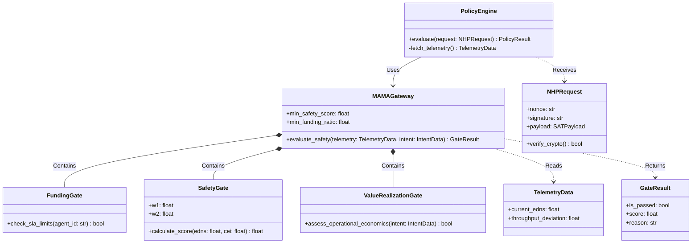

# ZTCPP Class Diagrams

## Core Policy Engine & MAMA Safety Gates

This diagram outlines the object-oriented structure of the ZTCPP Policy Engine.

```mermaid
classDiagram
    class PolicyEngine {
        +evaluate(request: NHPRequest) PolicyResult
        -fetch_telemetry() TelemetryData
    }

    class MAMAGateway {
        +min_safety_score: float
        +min_funding_ratio: float
        +evaluate_safety(telemetry: TelemetryData, intent: IntentData) GateResult
    }

    class FundingGate {
        +check_sla_limits(agent_id: str) bool
    }

    class SafetyGate {
        +w1: float
        +w2: float
        +calculate_score(edns: float, cei: float) float
    }

    class ValueRealizationGate {
        +assess_operational_economics(intent: IntentData) bool
    }

    class NHPRequest {
        +nonce: str
        +signature: str
        +payload: SATPayload
        +verify_crypto() bool
    }

    class TelemetryData {
        +current_edns: float
        +throughput_deviation: float
    }

    class GateResult {
        +is_passed: bool
        +score: float
        +reason: str
    }

    PolicyEngine --> MAMAGateway : Uses
    MAMAGateway *-- FundingGate : Contains
    MAMAGateway *-- SafetyGate : Contains
    MAMAGateway *-- ValueRealizationGate : Contains
    MAMAGateway ..> TelemetryData : Reads
    MAMAGateway ..> GateResult : Returns
    PolicyEngine ..> NHPRequest : Receives
```
