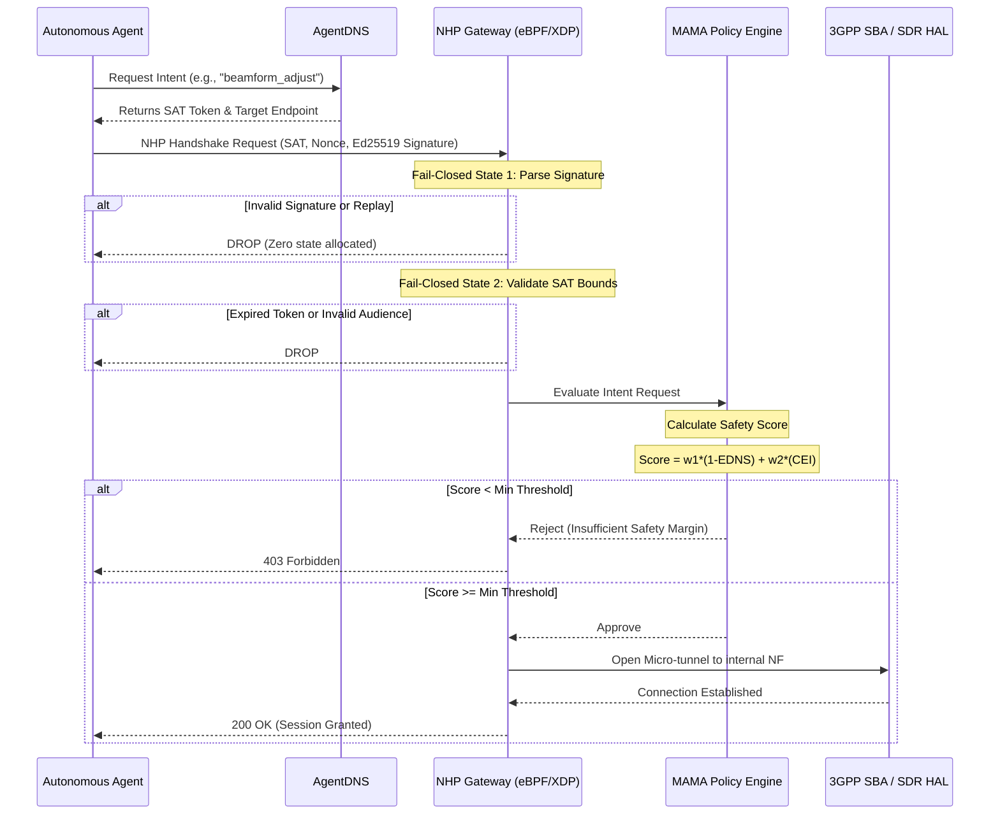

# ZTCPP Sequence Diagrams

## Authenticated-before-Connect (AbC) Workflow & MAMA Gate Verification

This sequence diagram illustrates the Zero-Trust fail-closed handshake process.

```mermaid
sequenceDiagram
    participant Agent as Autonomous Agent
    participant DNS as AgentDNS
    participant NHP as NHP Gateway (eBPF/XDP)
    participant MAMA as MAMA Policy Engine
    participant SBA as 3GPP SBA / SDR HAL

    %% Phase 1: Intent Resolution
    Agent->>DNS: Request Intent (e.g., "beamform_adjust")
    DNS-->>Agent: Returns SAT Token & Target Endpoint

    %% Phase 2: Edge Verification (AbC)
    Agent->>NHP: NHP Handshake Request (SAT, Nonce, Ed25519 Signature)
    
    note over NHP: Fail-Closed State 1: Parse Signature
    alt Invalid Signature or Replay
        NHP-->>Agent: DROP (Zero state allocated)
    end
    
    note over NHP: Fail-Closed State 2: Validate SAT Bounds
    alt Expired Token or Invalid Audience
        NHP-->>Agent: DROP
    end

    %% Phase 3: MAMA Deterministic Policy Evaluation
    NHP->>MAMA: Evaluate Intent Request
    note over MAMA: Calculate Safety Score
    note over MAMA: Score = w1*(1-EDNS) + w2*(CEI)
    
    alt Score < Min Threshold
        MAMA-->>NHP: Reject (Insufficient Safety Margin)
        NHP-->>Agent: 403 Forbidden
    else Score >= Min Threshold
        MAMA-->>NHP: Approve
        NHP->>SBA: Open Micro-tunnel to internal NF
        SBA-->>NHP: Connection Established
        NHP-->>Agent: 200 OK (Session Granted)
    end
```
