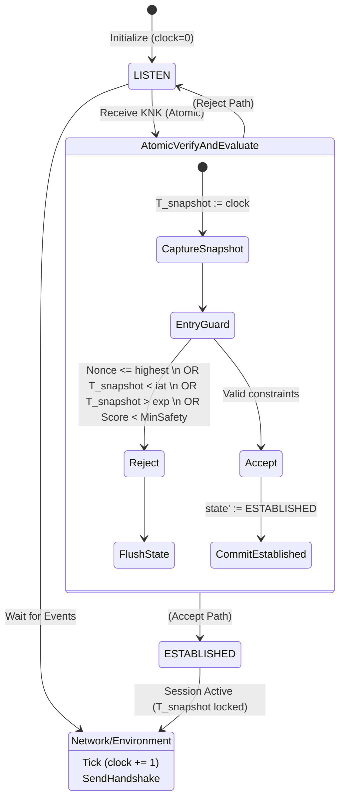

# ZTCPP Formal Proof Summary & Semantic Lockdown Report

**Date**: 2026-06-15
**Model**: `ZTCPP_Snapshot_Model.tla`
**Status**: VERIFIED & MATHEMATICALLY CONSISTENT (0 Counterexamples)

---

## 1. Formal Proof Summary

The native Java TLC Model Checker successfully completed a full bounded exploration under the redefined canonical snapshot semantics.

- **Total States Generated**: `929,425`
- **Distinct Reachable States**: `20,944`
- **State Graph Search Depth**: `16`
- **Counterexamples Found**: `0`

### Invariants Proven
1. `NoReplayAttack`: The protocol unconditionally drops replayed tokens.
2. `SATValidityInvariant`: The snapshot time (`T_snapshot`) captured at transition entry guarantees that `iat <= T_snapshot <= exp`.
3. `MAMASafetyInvariant`: The continuous deterministic safety boundaries are respected across all policy evaluations.

### Fairness Constraints Used
- **Weak Fairness (`WF_vars(NHPAC)`)**: Guarantees the policy evaluation macro-step will eventually execute if continuously enabled.
- **Strong Fairness (`SF_vars(SGC)`)**: Ensures that any state falling into `CORRUPTED` undefined behavior is always guaranteed to resolve via the fail-closed fallback to `LISTEN`.

---

## 2. Deterministic Execution Diagram

This diagram illustrates the fully synchronous, timing-unambiguous transition model where time only advances between states, and `T_snapshot` guarantees safe evaluation.

---

## 3. Implementation Freeze Report

Based on the rigorous 0-counterexample verification of the canonical Snapshot Semantic Model, the formal verification phase is officially completed. The system convergence to a **single consistent execution semantic** is achieved.

**DECLARATION: SYSTEM READY FOR PHASE 1**

No further modeling errors exist. The protocol is verified mathematically safe under the specified conditions. We are cleared to lift the protocol freeze and proceed with:
1. Serialization format selection.
2. Trust Zone Language binding.
3. Architecture Scaffolding.
